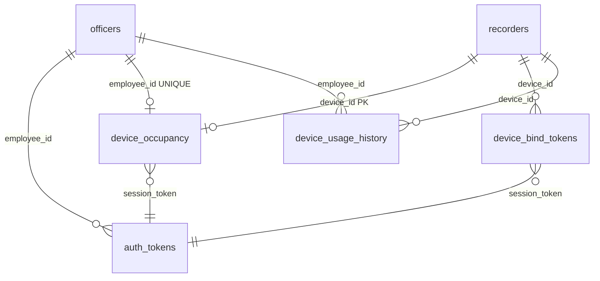

# 数据库设计

> 权威实现：`backend/app/officer_db.py`、`recorder_db.py`、`device_bind_db.py`、`device_bind_store.py`  
> 初始化脚本：`backend/scripts/init_mysql.sql`（MySQL 冷启动）或 `officer_db.init_db()`（启动时自动建表 + migrate）

## 1. 总览

| 项 | 说明 |
|----|------|
| **库名** | MySQL：`aifieldcam`；开发默认 SQLite：`backend/data/officers.db` |
| **驱动** | `OFFICER_DB_DRIVER=sqlite`（默认）或 `mysql`；设 `MYSQL_HOST` 且无 `sqlite` 时亦走 MySQL |
| **表数量** | 6 张，同库、同事务边界 |
| **时间字段** | 均为 UTC ISO8601 字符串（`VARCHAR`），非 `DATETIME` |

### 1.1 权威源分层

扫码绑定模型下，**不要把 `officers.device_id` 当成「当前占用哪台执法仪」的唯一真相**。

```
长期人员档案          officers          工号、组织、人脸、在岗状态
设备台账              recorders         DSJ- 设备、所属公司、故障、展示用占用
当前占用（会话）      device_occupancy  一机一人、一人一机 —— 执勤权威
会话凭证              auth_tokens       手机 token / 绑定后 session_token
扫码短期凭证          device_bind_tokens
占用历史              device_usage_history
```

| 问题 | 查哪里 |
|------|--------|
| 某人是否在岗、属于哪家公司 | `officers.status`、`officers.company` |
| **此刻** 谁在用这台 DSJ | `device_occupancy`（无行 = 空闲） |
| **此刻** 某人占用了哪台 DSJ | `device_occupancy`（无行 = 未执勤） |
| 设备属于哪家公司、是否故障 | `recorders.company`、`recorders.is_faulty` |
| 大屏/列表「设备在用」展示 | `recorders.in_use`（由占用逻辑同步，可对账） |
| 执法仪 API 鉴权 | `auth_tokens` 中的 **session_token**（绑定成功后写入） |
| 手机 App 鉴权 | `auth_tokens` 中的 **mobile token**（登录/注册写入） |

### 1.2 ER 关系（逻辑）



---

## 2. 表结构

### 2.1 `officers` — 人员权威档案

| 列 | 类型 | 约束 | 说明 |
|----|------|------|------|
| `employee_id` | VARCHAR(32) | **PK** | 工号，规范为 6 位数字 |
| `name` | VARCHAR(64) | NOT NULL | 姓名 |
| `gender` | VARCHAR(8) | DEFAULT `未知` | 男 / 女 / 未知 |
| `id_card` | VARCHAR(32) | UNIQUE NULL | 身份证 |
| `company` | VARCHAR(128) | NULL | 所属公司（扫码绑定时须与设备公司一致） |
| `department` | VARCHAR(128) | NOT NULL | 部门 |
| `position` | VARCHAR(64) | NULL | 职位 |
| `phone` | VARCHAR(16) | UNIQUE NULL | 手机号 |
| `device_id` | VARCHAR(128) | **UNIQUE** NOT NULL | 见 §3.1 占位语义 |
| `face_vector` | MEDIUMTEXT | NULL | 人脸特征 JSON 数组 |
| `status` | TINYINT | DEFAULT 2 | `0` 离职 / `1` 在岗 / `2` 注册办理中 |
| `created_at` | VARCHAR(64) | NOT NULL | |
| `updated_at` | VARCHAR(64) | NOT NULL | |
| `last_device_id` | VARCHAR(128) | NULL | 上次绑定设备（离职等场景） |
| `resigned_at` | VARCHAR(64) | NULL | 离职时间 |

**索引**：`uq_officers_phone`、`uq_officers_device`、`uq_officers_id_card`、`idx_officers_status`

**业务规则**

- 在岗人员：`status = 1`；仅在岗可扫码绑定。
- 手机自助注册成功后写入 `status = 1`，`device_id = __pool__{工号}`（见 §3.1）。
- **解绑/关机不修改 `status`**；人员仍在岗，可再次扫码。
- 离职注销：释放唯一约束字段（手机、身份证、`device_id` 改为 `__resigned__*` 占位）。

---

### 2.2 `auth_tokens` — 会话 Token

| 列 | 类型 | 约束 | 说明 |
|----|------|------|------|
| `token` | VARCHAR(128) | **PK** | 随机 URL-safe 字符串 |
| `employee_id` | VARCHAR(32) | NOT NULL | |
| `phone` | VARCHAR(16) | NOT NULL | |
| `created_at` | VARCHAR(64) | NOT NULL | |

**两类 token（同表，靠写入时机区分）**

| 来源 | 用途 | 写入路径 |
|------|------|----------|
| 手机登录/注册 | `Authorization` 头，供 `bind/confirm` | `officer_db.save_token` |
| 扫码绑定成功 | 执法仪后续 API 鉴权 | `device_bind_store._insert_auth_token` |

解绑/关机：删除该设备占用对应的 `session_token` 行；手机 token 不受影响。

---

### 2.3 `recorders` — 执法仪台账

| 列 | 类型 | 约束 | 说明 |
|----|------|------|------|
| `device_id` | VARCHAR(128) | **PK** | 如 `DSJ-5eb16384ad12baba` |
| `device_name` | VARCHAR(128) | NOT NULL | 展示名，默认 `执法仪-{后缀}` |
| `model` | VARCHAR(64) | DEFAULT `DSJ-ZECN6A1` | |
| `company` | VARCHAR(128) | NULL | **入库所属公司**；扫码前必填 |
| `in_use` | TINYINT(1) | DEFAULT 0 | 展示：是否占用 |
| `employee_id` | VARCHAR(32) | NULL | 展示：当前工号 |
| `is_faulty` | TINYINT(1) | DEFAULT 0 | 故障标记，故障机不可绑定 |
| `fault_note` | VARCHAR(512) | NULL | |
| `binding_phase` | TINYINT | DEFAULT 0 | `0` 空闲 / `1` 办理中 / `2` 在岗 |
| `bound_at` | VARCHAR(64) | NULL | 最近绑定时间 |
| `unbound_at` | VARCHAR(64) | NULL | 最近解绑时间 |
| `last_seen_at` | VARCHAR(64) | NULL | 最后在线 |
| `remark` | VARCHAR(512) | NULL | |
| `created_at` | VARCHAR(64) | NOT NULL | |
| `updated_at` | VARCHAR(64) | NOT NULL | |

**索引**：`idx_recorders_in_use`、`idx_recorders_employee`、`idx_recorders_faulty`

**与占用的关系**：`confirm_bind` → `mark_active`；`release_bind` / `shutdown_bind` → `in_use=0`。启动时 `backfill_from_officers()` 可从旧 `officers` 数据对齐一次。

---

### 2.4 `device_bind_tokens` — 扫码短期凭证

| 列 | 类型 | 约束 | 说明 |
|----|------|------|------|
| `id` | BIGINT | PK AUTO | |
| `device_id` | VARCHAR(128) | NOT NULL | |
| `token` | VARCHAR(128) | **UNIQUE** | 二维码参数 |
| `status` | VARCHAR(16) | DEFAULT `pending` | `pending` / `consumed` / `expired` |
| `expires_at` | VARCHAR(64) | NOT NULL | TTL 默认 300s |
| `session_token` | VARCHAR(128) | NULL | 绑定成功后填入 |
| `employee_id` | VARCHAR(32) | NULL | 绑定成功后填入 |
| `reject_reason` | VARCHAR(512) | NULL | 占用冲突等拒绝原因 |
| `created_at` | VARCHAR(64) | NOT NULL | |

**索引**：`idx_bind_device`、`idx_bind_status`

刷新二维码：将该设备旧 `pending` 标为 `expired`，插入新 `pending` 行。

---

### 2.5 `device_occupancy` — 当前占用（执勤权威）

| 列 | 类型 | 约束 | 说明 |
|----|------|------|------|
| `device_id` | VARCHAR(128) | **PK** | 一机最多一行 |
| `employee_id` | VARCHAR(32) | **UNIQUE** | 一人最多一行 |
| `started_at` | VARCHAR(64) | NOT NULL | 占用开始 |
| `session_token` | VARCHAR(128) | NOT NULL | 与 `auth_tokens` 对应 |

**约束语义**：同时保证「一机一人」「一人一机」。

---

### 2.6 `device_usage_history` — 使用历史

| 列 | 类型 | 约束 | 说明 |
|----|------|------|------|
| `id` | BIGINT | PK AUTO | |
| `device_id` | VARCHAR(128) | NOT NULL | |
| `employee_id` | VARCHAR(32) | NOT NULL | |
| `started_at` | VARCHAR(64) | NOT NULL | |
| `ended_at` | VARCHAR(64) | NOT NULL | |
| `end_reason` | VARCHAR(32) | NOT NULL | 见下表 |

**`end_reason` 枚举**

| 值 | 触发 |
|----|------|
| `unbind` | 设置中主动解绑 |
| `shutdown` | 关机/重启 |
| `admin` | 管理端强制 |
| `migrate` | 换机/迁移（预留） |

**索引**：`idx_usage_device`、`idx_usage_employee`

---

## 3. 关键语义

### 3.1 `officers.device_id` 占位值

因 `device_id` 有 **UNIQUE NOT NULL**，无法存「空设备」，用前缀区分：

| 前缀 | 示例 | 含义 |
|------|------|------|
| `__pool__` | `__pool__994405` | 手机注册后在岗、**尚未**扫码占机 |
| `__resigned__` | `__resigned__994405` | 已离职，释放真实 DSJ 唯一槽 |
| `__resigned_p__` | （手机占位） | 离职释放手机号唯一槽 |
| `__resigned_i__` | （身份证占位） | 离职释放身份证唯一槽 |
| `DSJ-*` | 真实设备号 | **旧模型**：8 步注册直接绑死一台机；或历史数据 |

新模型下，**当前占用的真实 `DSJ-*` 只出现在 `device_occupancy.device_id`**，不必回写 `officers.device_id`。

### 3.2 `officers.status`

| 值 | 标签 | 说明 |
|----|------|------|
| 0 | 已离职 | 不可绑定、不可执勤 |
| 1 | 在岗 | 可手机登录、可扫码占机 |
| 2 | 注册办理中 | 旧 8 步流程中间态；手机注册直接进 `1` |

---

## 4. 核心流程与写库顺序

### 4.1 手机注册（在岗池）

```
POST /auth/mobile/register
  → officers INSERT/UPDATE（status=1, device_id=__pool__{工号}, face_vector, company…）
  → auth_tokens INSERT（mobile token）
```

不写入 `device_occupancy`、`recorders.in_use`。

### 4.2 执法仪刷二维码

```
POST /auth/device/bind/token
  → recorders.ensure（无则建默认行）
  → 校验 recorders.company 非空
  → device_bind_tokens INSERT（pending，旧 pending→expired）
```

### 4.3 手机确认绑定

```
POST /auth/device/bind/confirm  (+ mobile Authorization)
  校验链：
    1. mobile token → employee_id
    2. officers 在岗
    3. officer.company == recorder.company
    4. recorder 非故障
    5. bind token pending 且未过期
    6. device_occupancy：设备无他人 / 人员无他机（含 legacy recorders 兜底）

  成功写库：
    device_bind_tokens → consumed + session_token + employee_id
    device_occupancy   → UPSERT
    auth_tokens        → INSERT session_token
    recorders          → mark_active(in_use=1, binding_phase=2)
```

### 4.4 解绑 / 关机

```
POST /auth/device/bind/release | shutdown
  → device_usage_history INSERT
  → DELETE device_occupancy
  → DELETE auth_tokens WHERE token = session_token
  → recorders SET in_use=0, employee_id=NULL, binding_phase=0
```

`officers` **不变**（仍在岗，`device_id` 仍为 `__pool__*` 或历史值）。

### 4.5 流程图

```
[手机注册] ──► officers(在岗, __pool__)
                    │
[手机登录] ──► auth_tokens(mobile)
                    │
[执法仪 QR] ──► device_bind_tokens(pending)
                    │
         [手机扫码 confirm]
                    ▼
    device_occupancy + auth_tokens(session) + recorders.in_use
                    │
         [解绑/关机]
                    ▼
    device_usage_history + 清空占用 + 撤销 session
```

---

## 5. 模块与 API 映射

| 模块 | 职责 |
|------|------|
| `officer_db.py` | 建表、migrate、`officers` / `auth_tokens` CRUD、唯一性校验 |
| `recorder_db.py` | `recorders` 台账、`mark_active` / `mark_registering`、公司字段 |
| `device_bind_db.py` | 三张扫码相关表的 DDL 常量 |
| `device_bind_store.py` | token 生命周期、占用 UPSERT、解绑、历史 |
| `patrol_store.py` | 手机注册/登录、**旧**执法仪人脸登录（见 §6） |

| HTTP | 主要触及表 |
|------|------------|
| `POST /auth/mobile/register` | `officers`, `auth_tokens` |
| `POST /auth/mobile/login` | `auth_tokens` |
| `POST /auth/device/bind/*` | 全部 6 表（视操作而定） |
| `PATCH /v1/recorders/{id}/company` | `recorders` |
| `POST /auth/patrol/*` | `officers`, `auth_tokens`, `recorders`（遗留） |

---

## 6. 遗留模型与兼容

| 能力 | 数据依赖 | 状态 |
|------|----------|------|
| 扫码绑定 + 公司设备池 | `device_occupancy` + `recorders.company` | **当前主路径** |
| 8 步注册 / `activate_officer(DSJ-*)` | `officers.device_id = DSJ` | 保留 API，执法仪 UI 已弃用 |
| `login_officer` / `login_officer_by_device` | 要求 `officers.device_id == 本机 DSJ` | 与 `__pool__` 模型**不兼容**；新执勤走 session_token |
| `check_device_bindable` | 同时查 `recorders` + `officers.device_id` | 防旧数据一人多机 |
| 启动 `backfill_from_officers` | `officers` → `recorders` | 一次性对齐历史 |

**对账建议**：以 `device_occupancy` 为准；若 `recorders.in_use` 不一致，查 `release_bind` 是否走过、或是否仅有旧 `officers` 绑定无占用行。

---

## 7. 运维

### 7.1 初始化

```bash
# MySQL 冷启动（可选，与 init_db 等价）
mysql -u root -p < backend/scripts/init_mysql.sql

# 或启动后端自动建表
uvicorn app.main:app  # 内部调用 officer_db.init_db()
```

### 7.2 环境变量

| 变量 | 默认 | 说明 |
|------|------|------|
| `OFFICER_DB_DRIVER` | 自动 | `sqlite` / `mysql` |
| `OFFICER_DB_PATH` | `backend/data/officers.db` | SQLite 路径 |
| `MYSQL_HOST` … `MYSQL_DATABASE` | — | MySQL 连接 |
| `PUBLIC_API_BASE` | — | 拼完整扫码 URL |

### 7.3 常用诊断 SQL

```sql
-- 当前谁在用哪台机
SELECT o.device_id, o.employee_id, o.started_at, f.name, f.company
FROM device_occupancy o
JOIN officers f ON f.employee_id = o.employee_id;

-- 设备台账 vs 占用
SELECT r.device_id, r.company, r.in_use, r.employee_id AS recorder_eid,
       d.employee_id AS occupancy_eid
FROM recorders r
LEFT JOIN device_occupancy d ON d.device_id = r.device_id;

-- 待扫码的在岗人员（池内）
SELECT employee_id, name, company, device_id
FROM officers
WHERE status = 1 AND device_id LIKE '__pool__%';
```

---

## 8. 后续演进（未建表）

以下能力在 PRD 中提及，**当前库中尚无独立表**，会话类数据仍在内存（`session_store`）或待立项：

- 报障工单、组长确认、管理员审批
- AI 对话 / 识图会话持久化
- 录像元数据、云端索引

新增表时应继续放在 `aifieldcam` 同库，并在本文档 §2 增补，保持「占用权威在 `device_occupancy`」不变。

---

## 9. 术语对照

与 [`CONTEXT.md`](../../CONTEXT.md) 一致：

- **云端档案** → `officers`
- **设备入库** → `recorders` + `company`
- **设备占用** → `device_occupancy`
- **使用历史** → `device_usage_history`
- **解绑** → 结束占用，非离职
