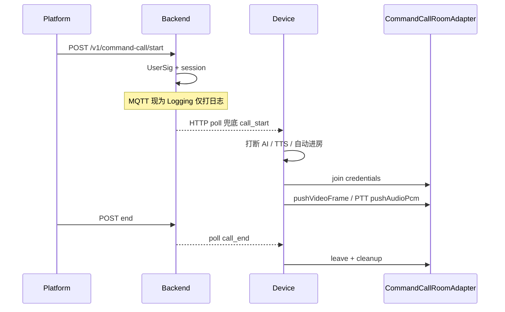

# Handoff: 指挥连线（Command Call / TRTC）

> 日期: 2026-07-21  
> 用途: 新会话/下一任 agent 可独立续作，**不必重跑 grill / to-prd**（除非产品范围变了）。

## 1. 一句话状态

指挥连线 **业务主路径（Issues 1–6）已在 Fake 上可测**；**真 TRTC Android 适配器 + React 指挥连线台已落地**（见下方 Next / 计划）。生产 App 启动注入 `TrtcCommandCallRoomAdapter`；联调需后端 `TRTC_*` 与真机/浏览器。

## 1b. 2026-07-21 实现追加

- Android: `TrtcCommandCallRoomAdapter` + LiteAV `12.5.0.17575` + `AiFieldCamApplication` 默认 `CommandCallRoom.use`
- Web: [`web-console/`](../../../web-console/) Vite+React+trtc-sdk-v5 指挥连线台
- Design: [`2026-07-21-command-call-trtc-real-design.md`](../specs/2026-07-21-command-call-trtc-real-design.md)
- Plan: [`2026-07-21-command-call-trtc-real.md`](../plans/2026-07-21-command-call-trtc-real.md)
- 单测：`runUnitTestsInline` **73 passed**（仍 Fake）；CI 不接腾讯云

下一刀可选：真 MQTT、联调验收剧本、冻结 stub WebRTC。

## 2. 必读锚点

| 文档 | 路径 |
|------|------|
| PRD | [`docs/prd/command-call-trtc.md`](../../prd/command-call-trtc.md) |
| ADR | [`docs/adr/0002-trtc-for-command-calls.md`](../../adr/0002-trtc-for-command-calls.md) |
| 领域词 | [`CONTEXT.md`](../../../CONTEXT.md) |

**已完成 plans（勿再 triage Issues 1–6）：**

- [`2026-07-20-command-call-skeleton.md`](../plans/2026-07-20-command-call-skeleton.md) — 会话 API + UserSig + 信令进/退房（Fake）
- [`2026-07-20-command-call-co-capture.md`](../plans/2026-07-20-command-call-co-capture.md) — 录像旁路 → 约 720p → `pushVideoFrame`
- [`2026-07-20-command-call-intercom.md`](../plans/2026-07-20-command-call-intercom.md) — F6 长按上行 / 短按白光 / 半双工
- [`2026-07-20-command-call-ai-priority.md`](../plans/2026-07-20-command-call-ai-priority.md) — 来电打断 AI；结束不恢复
- [`2026-07-20-command-call-failure-feedback.md`](../plans/2026-07-20-command-call-failure-feedback.md) — timeout/offline/join 失败清理

Issue 1（`CommandCallRoomAdapter` / Fake 接缝）无独立 plan，已在 skeleton 中标注合入。

## 3. 架构接缝



### 主接缝（下一刀入口）

- 接口：[`CommandCallRoomAdapter`](../../../android-app/app/src/main/kotlin/com/aifieldcam/app/platform/commandcall/CommandCallRoomAdapter.kt)
  - `join` / `leave` / `state` / `isInRoom`
  - `enableCustomVideoSource` / `pushVideoFrame`
  - `setLocalAudioMuted` / `isLocalAudioMuted` / `pushAudioPcm`
- 持有点：[`CommandCallRoom`](../../../android-app/app/src/main/kotlin/com/aifieldcam/app/platform/commandcall/CommandCallRoom.kt) — `current()` / `use(adapter)` / `resetToFake()`
- **生产默认** `AiFieldCamApplication` → `CommandCallRoom.use(TrtcCommandCallRoomAdapter)`；单测 `resetToFake()`。

### 设备业务链

| 角色 | 路径 |
|------|------|
| 控制器 | `commandcall/CommandCallController.kt` |
| 集成 | `data/SessionManager.kt`（`onCommandCallStart/End`、TTS、HTTP poll） |
| MQTT 订阅 | `platform/MqttTopicRouter.kt` → SessionManager |
| 共摄 | `CommandCallCoCapture` + `RecordingCommandCallFrameSource` |
| 对讲 | `CommandCallIntercom` + `CommandCallIntercomPolicy`（F6） |
| AI 优先级 | `CommandCallAiPriority` / `CommandCallAiGate`；`PttSnapAskController` |

### 后端

| 文件 | 状态 |
|------|------|
| `backend/app/command_call_session.py` | 会话生命周期、占用校验、poll、超时 sweep |
| `backend/app/usersig.py` | **已实现** TLSSigAPIv2；env `TRTC_SDK_APP_ID` / `TRTC_SECRET_KEY` |
| `backend/app/command_call_mqtt.py` | 生产默认 `LoggingCommandCallMqttPublisher`（只打日志，不发 broker） |
| `backend/app/main.py` | `POST/GET /v1/command-call/*`；`/health` → `trtc` |

设备 **不** 上行 answer / busy / hangup。信令 today 可靠路径是 **HTTP poll**；MQTT 端到端未打通。

## 4. Done / Next

| 优先级 | 内容 | 交接备注 |
|--------|------|----------|
| **已落地** | 真 TRTC Android 适配器 + `web-console` 指挥连线台 | 计划 `2026-07-21-command-call-trtc-real.md`；待真机联调 |
| 并行可选 | 后端真 MQTT 下发 | 设备主路径才完整；HTTP poll 已能兜底 |
| 其后 | 联调验收剧本 / 冻结 stub WebRTC | 避免双栈 |

### 明确不要做

- 重 triage Issues 1–6；重跑 grill / to-prd（除非产品范围变了）
- 设备主动呼叫、拒接、忙线、设备挂断、TUICallKit、多人会议、TRTC 云端录制、替代 GB28181（见 PRD Out of Scope）

## 5. 工作区注意（2026-07-21 快照）

交接时工作区仍有 **未提交** 改动（以当时 `git status` 为准；续作前先确认是否已 commit）：

**已修改：**

- `android-app/app/build.gradle.kts`（注册失败清理单测）
- `android-app/app/src/main/kotlin/.../CommandCallController.kt`
- `android-app/app/src/main/kotlin/.../FakeCommandCallRoomAdapter.kt`
- `backend/app/command_call_session.py`

**未跟踪：**

- `android-app/app/src/test/.../CommandCallFailureCleanupTest.kt`
- `docs/superpowers/plans/2026-07-20-command-call-failure-feedback.md`

这些对应 Issue 6（失败反馈 / 清理）。开真 TRTC 前建议先落盘或明确是否并入同一 PR。

**环境：**

- 本机 `gh` 可能未登录（`gh auth login` 或设 `GH_TOKEN`）；剩余项写成 GitHub Issues 前需先鉴权。
- 真 TRTC / UserSig 需后端 env 配齐；缺配置时 `start` 应 503，`/health.trtc` 为 false。

## 6. 关键文件速查

### Android `platform/commandcall/`

`CommandCallRoomAdapter.kt` · `CommandCallRoom.kt` · `FakeCommandCallRoomAdapter.kt` · `CommandCallController.kt` · `CommandCallSignalParser.kt` · `CommandCallCoCapture.kt` · `CommandCallFrameSource.kt` · `RecordingCommandCallFrameSource.kt` · `CommandCallVideoFrame.kt` · `CommandCallVideoScale.kt` · `CommandCallIntercom.kt` · `CommandCallAudioCapture.kt` · `CommandCallIntercomPolicy.kt` · `CommandCallAiPriority.kt`

### 测试

`android-app/app/src/test/.../commandcall/*`（含 skeleton / co-capture / intercom / AI / failure cleanup）  
`backend/tests/test_command_call_skeleton.py`

### API（设备 / 平台）

- `POST /v1/command-call/start`
- `GET /v1/command-call/{call_id}`
- `POST /v1/command-call/{call_id}/end`
- `GET /v1/command-call/device/{device_id}/poll`

## 7. 下一会话开场白（可复制）

```
实现 Issue：真 TRTC 房间适配器。

必读：
- docs/prd/command-call-trtc.md
- docs/superpowers/handoffs/2026-07-21-command-call.md
- docs/adr/0002-trtc-for-command-calls.md

范围：
- 实现 CommandCallRoomAdapter 的生产 TRTC 类（join/leave/自定义视频源/PCM 上行/静音）
- 在 App 启动或 DI 处 CommandCallRoom.use(真实适配器)
- build.gradle 引入 TRTC Android SDK
- 不改连线信令契约与 Issues 1–6 业务行为
- 单测继续用 Fake；勿接腾讯云做 CI 黑盒

不要：重做 Issues 1–6、重跑 grill/to-prd、做 Web 控制台或真 MQTT（除非本 Issue 明确包含）。
```

可选并行开场：`先把剩余项写成 GitHub Issues（真 TRTC / 真 MQTT / Web 控制台 / 冻结 stub WebRTC）` — 需先 `gh auth login`。
