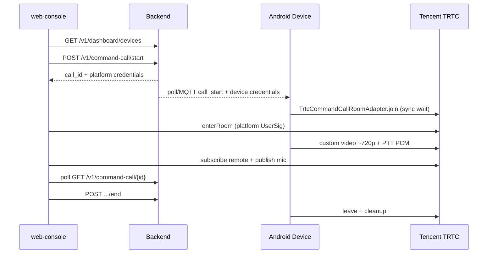

# 指挥连线真 TRTC + Web 连线台 — Design

> 日期: 2026-07-21  
> 状态: Approved  
> PRD: [`docs/prd/command-call-trtc.md`](../../prd/command-call-trtc.md)  
> ADR: [`docs/adr/0002-trtc-for-command-calls.md`](../../adr/0002-trtc-for-command-calls.md)  
> Handoff: [`docs/superpowers/handoffs/2026-07-21-command-call.md`](../handoffs/2026-07-21-command-call.md)

## Goal

尽快打通 **浏览器座席 ↔ 执法仪真机** 经腾讯云 TRTC 的实时音视频：座席能看现场画面、常开麦喊话；设备自动进房、连线共摄旁路推流、PTT 半双工回传。

## Decisions (locked)

| 项 | 选择 |
|----|------|
| 交付形态 | 同一竖切：Android 真适配器 → React 指挥连线台 |
| Android 适配器 | `TrtcCommandCallRoomAdapter` 直接调 LiteAV；JVM 单测只碰 Fake |
| `join` | 保持同步 `Boolean`；内部 `enterRoom` + 等待回调（超时约 8s） |
| 生产注入 | `AiFieldCamApplication.onCreate` → `CommandCallRoom.use(Trtc…)`；无 feature flag |
| Web | 新建 `web-console/`：Vite + React + TRTC Web SDK |
| 控制台范围 | **仅指挥连线台**（设备列表、发起/结束、视频、常开麦、状态/失败） |
| 登录 | 首期无；与现有 dashboard / command-call 开放 API 一致 |
| 信令 | 继续现有 HTTP poll 兜底；真 MQTT 不在本交付必达 |
| 连线中指示灯 | **红灯常亮**（优先于录像红闪；机无蓝灯） |
| 连线中按住 F6 | **黄灯常亮**（红+绿）；AI 长按聆听同为黄常亮 |
| 挂断后 AI | 仅恢复长按 F6 开 AI 能力；**不**自动接回被打断会话 |

---

## Out of scope

- 运营大后台（入库、绑定、人事、相册、大屏 KPI 全量）
- 设备主动呼叫、拒接、忙线、设备挂断、TUICallKit
- TRTC 云端录制、多人会议、旁听观众
- 用 TRTC 替代 GB28181；重做 Issues 1–6
- CI 接腾讯云黑盒；JVM 实例化真适配器
- Engine 接缝层 / productFlavors / 生产默认 Fake 开关

## Architecture

### Android

- **接口不变**：`CommandCallRoomAdapter`（Issues 1–6 业务零契约变更）。
- **新类**：`TrtcCommandCallRoomAdapter(context)`  
  - `join`：`JOINING` → LiteAV `enterRoom` → 等 `onEnterRoom`（成功/失败/超时）→ `IN_ROOM` / `FAILED`  
  - `leave`：停自定义音视频 → `exitRoom` → `IDLE`  
  - 房间号：后端签发的是字符串 `room-{call_id}`，进房必须用 **`strRoomId`**（不用整型 `roomId`）  
  - 视频：`enableCustomVideoSource` + `pushVideoFrame`（旁路 JPEG 解码后 `sendCustomVideoData`）；禁止 `openCamera`  
  - 音频：默认本地静音；`setLocalAudioMuted(false)` + `pushAudioPcm`（16 kHz PCM）；避免 TRTC 自采麦抢第二路 AudioRecord  
- **依赖**：`com.tencent.liteav:LiteAVSDK_TRTC`（钉死版本号）+ `abiFilters` `armeabi-v7a` / `arm64-v8a`  
- **接线**：`AiFieldCamApplication` 启动时 `CommandCallRoom.use(TrtcCommandCallRoomAdapter(this))`；`CommandCallController.resetForTests` 仍 `resetToFake()`  

### Web (`web-console/`)

- Vite + React + TypeScript；TRTC Web SDK（官方 npm/CDN 用法择一，优先 npm）。  
- 单页指挥连线台：  
  1. 拉取 `GET /v1/dashboard/devices` 展示可选设备  
  2. `POST /v1/command-call/start` → 使用响应中的 `platform` 凭证进房（同样走字符串房间号 / `strRoomId`）  
  3. 远端视频播放 + 本地麦克风常开  
  4. 轮询 `GET /v1/command-call/{call_id}` 显示 `connecting` / `in_call` / `failed` / `ended` 与 `failure_reason`  
  5. `POST .../end` → 退房并清理 UI  
- `VITE_API_BASE` 指向后端；后端为本地 Vite origin 增加 CORS。  

### Backend (minimal)

- 已有 UserSig / session / poll；本交付仅补 **CORS**（及必要时静态说明文档）。  
- 不改连线信令契约；SecretKey 仍仅后端 env。  

## Error handling

- Android `join` 超时或 SDK 失败 → `FAILED`，控制器既有 `failAndCleanup` 路径生效。  
- Web：`start` 4xx/5xx、状态 `failed`、进房失败 → 明确文案；结束按钮在通话中始终可用。  
- 缺 `TRTC_*` 配置：后端 `/health.trtc=false`，`start` 失败明确。  

## Testing

- Android：现有 Fake / Controller / 共摄 / 对讲 / 失败清理套件保持绿；**不**在 JVM 测 LiteAV native。  
- Web：关键 API 客户端与状态机可用轻量单测或手动清单；真机+浏览器联调为最终验收。  
- 后端：既有 `test_command_call_skeleton` 等保持；CORS 可加最小契约测（可选）。  

## Acceptance

1. 真机安装含 Real 适配器的 APK；后端配置有效 `TRTC_SDK_APP_ID` / `TRTC_SECRET_KEY`。  
2. 浏览器打开 `web-console`，选择已占用设备并发起连线。  
3. 座席看到设备旁路画面，常开麦可对设备喊话。  
4. 设备 PTT 长按可上行；短按白光行为不变。  
5. 座席结束连线后双方退房/清理；超时或离线时座席看到失败状态。  

## Implementation order

1. Android Real adapter + Gradle + Application wire  
2. Backend CORS  
3. `web-console` scaffold + start/end/status + TRTC enterRoom UI  
4. 真机 + 浏览器联调验收（文档化步骤）  
